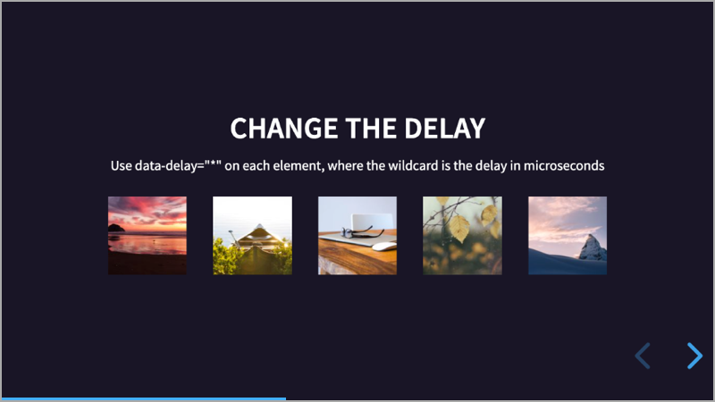

# Appearance

A plugin for [Reveal.js](https://revealjs.com) 4 that adds appearance effects to elements.

[](https://martinomagnifico.github.io/reveal.js-appearance/demo.html)

In Powerpoint you can make slides with items that appear automatically with effects. This plugin for Reveal.js tries to achieve the same result. It's easy to set up. It uses Animate.css by Daniel Eden for the animations, with some changes in a separate CSS file to allow for a non-animated state. 

[Demo](https://martinomagnifico.github.io/reveal.js-appearance/demo.html)

We do not want the animations to start during the slide transition, so we wait for the slide transition to end. Then the animations will start automatically if the HTML is set up to use Appearance.


## Installation

The Appearance plugin has been rewritten for Reveal.js version 4.

If you want to use Appearance with an older version of Reveal, use the [1.0.4 version](https://github.com/Martinomagnifico/reveal.js-appearance/releases).

### Regular installation

Copy the appearance folder to the plugins folder of the reveal.js folder, like this: `plugin/appearance`.

### npm installation

This plugin is published to, and can be installed from, npm.

```javascript
npm install reveal.js-appearance
```
The Appearance plugin folder can then be referenced from `node_modules/reveal.js-appearance/plugin/appearance`


## Setup

### JavaScript


There are two JavaScript files for Appearance, a regular one, `appearance.js`, and a module one, `appearance.esm.js`. You only need one of them:

#### Regular 
If you're not using ES modules, for example, to be able to run your presentation from the filesystem, you can add it like this:

```html
<script type="text/javascript" src="dist/reveal.js"></script>
<script src="plugin/appearance/appearance.js"></script>
<script>
	Reveal.initialize({
		// ...
		plugins: [ Appearance ]
	});
</script>
```
#### As a module 
If you're using ES modules, you can add it like this:

```html
<script type="module">
	// This will need a server
	import Reveal from './dist/reveal.esm.js';
	import Appearance from './plugin/appearance/appearance.esm.js';
	Reveal.initialize({
		// ...
		plugins: [ Appearance ]
	});
</script>
```

### Styling

You now need to add TWO stylesheets to your presentation. 

* The first one is Animate.css by Daniel Eden for the basic animations, and we can add it through a CDN.
* The second file is included with Appearance. It adds to the first stylesheet to allow for a non-animated state.

```html
<link rel="stylesheet" href="https://cdnjs.cloudflare.com/ajax/libs/animate.css/4.0.0/animate.min.css">
<link rel="stylesheet" href="plugin/appearance/appearance.css">
```


### HTML

It is easy to set up your HTML structure for Appearance: 

```html
<ul>
	<li class="animated bounceInLeft">Add it to any text element</li>
	<li class="animated bounceInLeft">Like list items, or headers.</li>
	<li class="animated bounceInLeft">It adds some attention.</li>
</ul>
```


## Configuration

There are a few options that you can change from the Reveal.js options. The values below are default and do not need to be set if they are not changed.

```javascript
Reveal.initialize({
	// ...
	appearance: {
		// The baseclass uses the baseclass from Animate.css. Change it if you like
		baseclass: 'animated',
		// Use a specific class for the visible state.
		visibleclass: 'in',
		// Change this if you want to see the shown elements if you go back
		hideagain: true,
		// Base time between appearances
		delay: 300
		
	},
	plugins: [ Appearance ]
});
```


## Now change it

It is easy to change the effects for Appearance. Here's how to change the delay per-element: 

```html


```
or the speed of each animation, using the tempo classes from Animate.css:
```html


```

## Like it?
If you like it, please star this repo! 

And if you want to show off what you made with it, please do :-)


## License
MIT licensed

Copyright (C) 2020 Martijn De Jongh (Martino)
